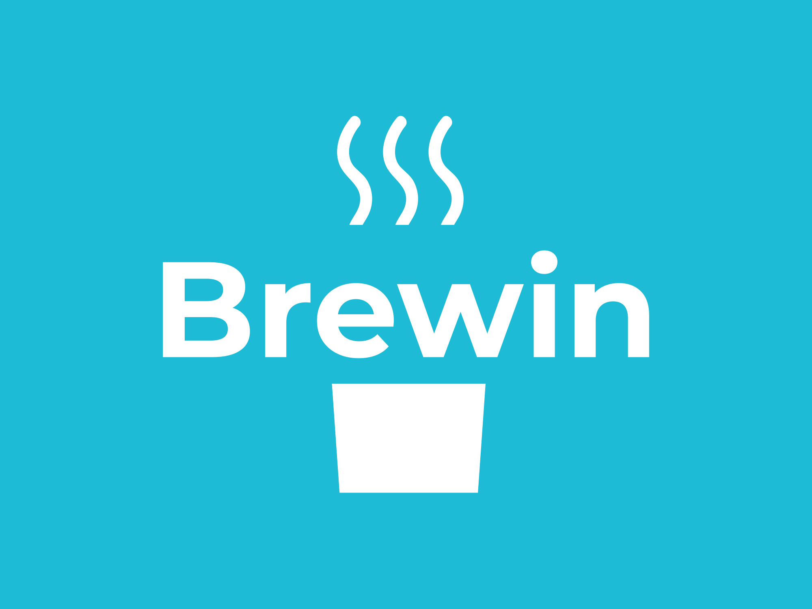

  

<h1>Brewin</h1>
<h4>An interpretted programming language written fully in Python.</h4>

## Previous Versions
- [Brewin v2](https://github.com/rudyorre/brewin-v2)
- [Brewin v1](https://github.com/rudyorre/brewin-v1)

## Undefined Behavior
As this language is in its infancy, there is a lot of undefined behavior, below are some of the more notable ones:
- Any syntax errors. You can assume that all programs will be syntactically correct.
- You will never have any nested double quotes inside strings in Brewin++. You may have single quotes inside double quotes.
- We will never call strtoint on a non-integral value.
- The program will always have valid indentation.
- You will never have variables with the same names as reserved keywords, e.g. `func`, `int`, etc.
  - Note: `lambda`, `this`, and object are new reserved keywords in Brewin#
- You can assume that we will not manually define a result variable in any of our tests. For example, we will never have the statement var int `resulti` in any of our tests.
  - This includes `resultf` and `resulto`.
- We will never call print with arguments of object or function types (a variable or a literal).
- Different from Project #2, we will always call functions (including lambda functions) with the correct number of arguments that match the definition. Feel free to keep the checking behavior in Project #2.
- As a result, there is no need to support implicit partial application/currying. We will not test you on this.
- We will never create a circular object when testing (e.g. x.a = x).
- Lambda functions can appear in object methods. But you can assume that the lambda functions defined within object method functions do not use or capture the variable “this”.
- We will not create variables that have the same name of globally-defined functions, or shadow a globally-defined function name with a variable.
- We will never assign built-in functions to func variables; i.e. we will not test you with `assign f input`, `assign f strtoint`, or `assign f print`

## Garbage Collection
All of those closures and objects you’re Brewin# programs are creating take up memory.  However, we simply rely upon Python’s garbage collection to free up discarded objects for us. There’s no need to build own garbage collector.

Hey there! This is a template repository that contains the necessary boilerplate for [CS 131](https://ucla-cs-131.github.io/fall-22/)'s quarter-long project: making an interpreter. The project specs are as follows:

1. [Project 1 Spec](https://docs.google.com/document/d/17Q4EPgHLMlMuQABhmgTpk_Ggxij0DZwvPQO2uzVVPzk/)
2. [Project 2 Spec](https://docs.google.com/document/d/14cZ7s-RPDO3FvYCDFMlS_NrGSSPUmavSX0wzsN-yHDw/)
3. [Project 3 Spec](https://docs.google.com/document/d/1YCSxxlHnuMBALfGzZNcDeY-AemcWxOlFQKHxsARk1Tg/)

There are three stages to the project; students are currently at the third. Thus, this folder contains the necessary bootstrapping code:

- `intbase.py`, the base class and enum definitions for the interpreter
- a sample `readme.txt`, which should illustrate any known bugs/issues with the program (or, an "everything's good!")

As well as **canonical solutions for Project 1 and 2** (written by Carey):

- `interpreterv1.py`/`interpreterv2.py`: a top-level entrypoint: has some utility classes, finding the main function, the interpreter loop, and handlers for each token type
- `env_v1.py`/`env_v2.py`: manages the "environment" / state for a program - includes scoping
- `func_v1.py`/`func_v2.py`: manages and caches functions, types
- `tokenize.py`: tokenization logic

You do not have to use the canonical solutions for Project 3; in particular, since you didn't write the code, it may be confusing!

Some notes on your submission (for Project 3)

1. You **must have a top-level, versioned `interpreterv3.py` file** that **exports the `Interpreter` class**. If not, **your code will not run on our autograder**.
2. You may also submit one or more additional `.py` modules that your interpreter uses, if you decide to break up your solution into multiple `.py` files.

You can find out more about our autograder, including how to run it, in [its accompanying repo](https://github.com/UCLA-CS-131/fall-22-autograder).

## Licensing and Attribution

This is an unlicensed repository; even though the source code is public, it is **not** governed by an open-source license.

This code was primarily written by [Carey Nachenberg](http://careynachenberg.weebly.com/), with support from his TAs for the [Fall 2022 iteration of CS 131](https://ucla-cs-131.github.io/fall-22/).

The logo was generated with [https://logo.com](https://logo.com).
