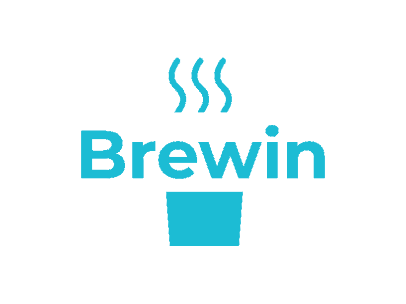

<p align="center">
  
</p>
<h1 align="center">Brewin</h1>
<h4 align="center">An interpretted programming language written fully in Python.</h4>

## Introduction

The purpose of this project is to create a simple programming language that is easy to learn and use. Brewin is an interpreted, statically-typed language that supports basic programming constructs such as variables, conditionals, loops, functions, and more. The language is designed to be easy to read and write, with a syntax that is similar to Python.

Also, this was my implementation for the Programming Language course at UCLA with Professor [Carey Nachenberg](http://careynachenberg.weebly.com/), so credits to him for the specifications and the idea of the language 🤩.

## Setup

Clone the repository and navigate to the Brewin directory:

```bash
git clone https://github.com/rudyorre/brewin.git
cd brewin
```

This was written fully with just Python's standard library, so no need to install any dependencies 🐍.

## Running a Brewin program

To run a program written in Brewin, use the following command:

```bash
python3 interpreterv3.py your_program.src
```

# Advanced Features

## First-Class Functions and Higher-Order Functions

In Brewin, functions are first-class citizens. This means that functions that
can be passed as arguments to other functions, returned as values from other
functions, assigned to variables, and stored in data structures. This feature
allows for the creation of higher-order functions, which are funcitons that take other functions as arguments, return functions as results, or both.

### Function Variables

You can define variables of the `func` type which can hold functions or closures. Here's an example:

```bash
var func f  # f has a type of func and is a func variable
```

In this example, `f` is a variable that can hold a function.

### Assigning Functions to Variables

You can assign functions to varible of type `func`. Here's an example:

```bash
func inc x:int int
  return + x 1
endfunc

assign f inc  # f holds the inc function!
```

In this example, the `inc` function is assigned to the variable `f`.

### Calling Functions Stored in Variables

You can call a function that is stored in a variable using the `funccall` keyword. Here's an example:

```bash
funccall f 10 # call inc thru f
```

In this example, the function sotred in the varible `f` is called with the argument `10`.

### Example Program

Here's a complete example program that demonstrates these concepts:

```bash
func inc x:int int
  return + x 1
endfunc

func main void
  var func f             # f has a type of func and is a func variable
  assign f inc           # f holds the inc function!
  funccall f 10          # call inc thru f
  funccall print resulti # prints 11
endfunc
```

In this program, the `inc` function is assigned to the variable `f`, and then called through `f`. The result is printed out, which is `11`.

## Lambdas and Closures

Brewin now supports the creation of anonymous functions, also known as lambda functions. These functions can be nested and can capture free variables, creating closures.

### Lambda Functions
Lambda functions are defined using the lambda keyword. They do not have a name and can be assigned to variables or returned from functions. Here's an example:

```bash
lambda y:int int     # defines a lambda/closure and stores in resultf
  var int z
  assign z + x y
  return z
endlambda
```

In this example, a lambda function is defined that takes an integer `y` and returns an integer. The lambda function is stored in the `resultf` variable.

### Closures
Closures are functions that capture free variables from their surrounding scope. In the example above, the lambda function captures the variable x from its surrounding scope, creating a closure.

### Returning Lambda Functions
You can return a lambda function from a function. Here's an example:

```bash
return resultf  # return our lambda/closure
```

In this example, the lambda function stored in `resultf` is returned from the function.

### Example Program
Here's a complete example program that demonstrates these concepts:

```bash
func create_lambda x:int func
  lambda y:int int     # defines a lambda/closure and stores in resultf
    var int z
    assign z + x y
    return z
  endlambda

  return resultf       # return our lambda/closure
endfunc

func main void
  var func f g
  funccall create_lambda 10   # create a lambda that captures x=10
  assign f resultf            # f holds our lambda's closure
 
  funccall create_lambda 100  # create a lambda that captures x=100
  assign g resultf            # f holds our lambda's closure

  funccall f 42
  funccall print resulti      # prints 52

  funccall g 42
  funccall print resulti      # prints 142
endfunc
```

In this program, the `create_lambda` function creates a lambda function that captures the variable `x`. This lambda function is then assigned to the variables `f` and `g` with different captured values for `x`. When the lambda functions stored in `f` and `g` are called, they use the captured values of `x` to compute their results.

## Objects

Brewin now supports the creation of objects which can hold an arbitrary set of member variables of all Brewin types (including function member variables and other object member variables). Brewin# doesn’t support classes, just objects, like JavaScript. To add a member to an object, you just assign it (e.g., `x.member = 10`, like in Python). Brewin# doesn’t require you to declare the member variables explicitly or specify their types.

### Creating and Using Objects
Here's an example of creating an object and using its members:

```bash
func main void
 var object foo             # foo is an object!
 assign foo.x 5             # creates a member x in foo, e.g., foo.x,
                            # and sets its value to 5
 assign foo.x + foo.x 1     # increments foo.x
 funccall print foo.x
 assign foo.x "bar"         # redefines foo.x to be a string
 funccall print foo.x
endfunc
```

In this example, an object `foo` is created, a member `x` is added to `foo` and its value is manipulated.

### Member Functions
You can add member functions to your objects. Here's an example:

```bash
# defines a function which will be used as a member function below
func foo i:int void
  assign this.val i    # sets the val member of the passed-in object
endfunc

func main void
  var object x	
  assign x.our_method foo      # sets x.our_method to foo()

  funccall x.our_method 42     # calls foo(42)
  funccall print x.val         # prints 42
endfunc
```

In this example, a function `foo` is defined and then assigned as a member function of the object `x`. The function `foo` uses the `this` keyword to access the object being operated on. In this case, `this` refers to object `x`.

### The `this` Keyword
Like C++’s `this` and Python’s `self`, the `this` keyword is used to access the object being operated on. In the example above, `this` refers to object `x`.
